# Week 4 class assignment

Folder name: `week-4-class-assignment`

Download the starter folder [here](https://github.com/coreinteraction-spring2016-a2/lab/blob/gh-pages/week-4/starter.zip?raw=true).

## Use `position: relative` to recreate the following layouts:

### 1

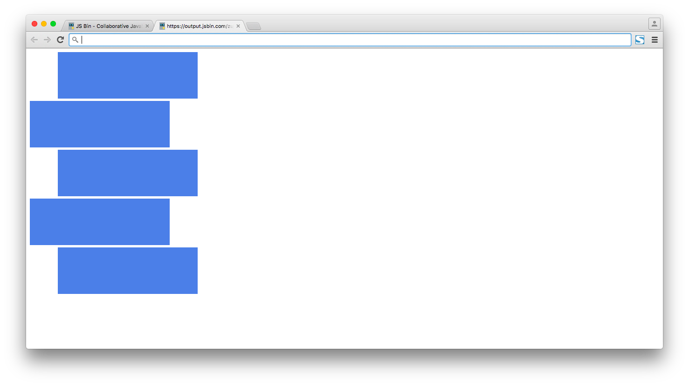

### 2

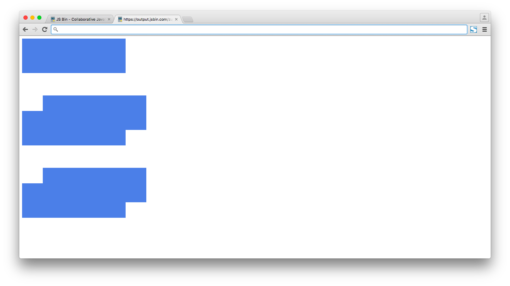

## Use `position: absolute` to recreate the following layouts:

### 3

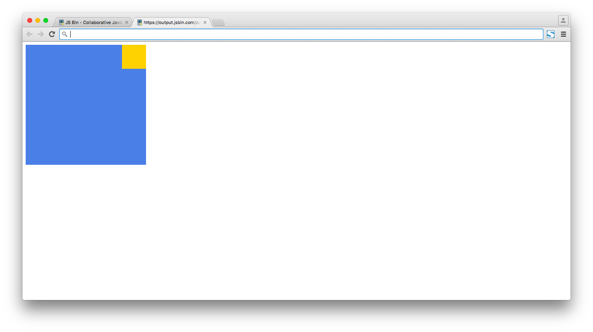

### 4

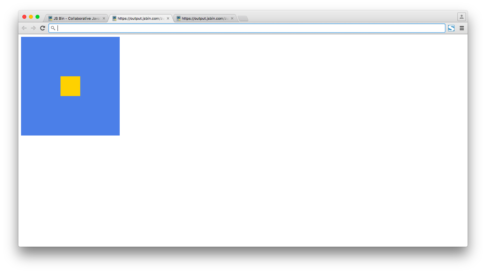

### 5

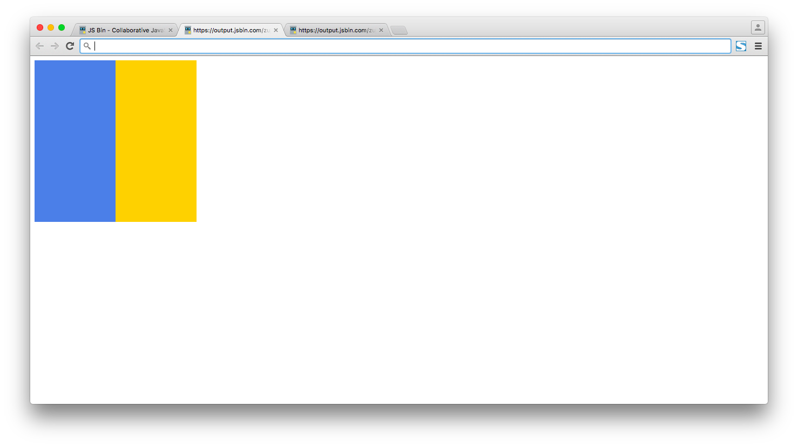

### 6

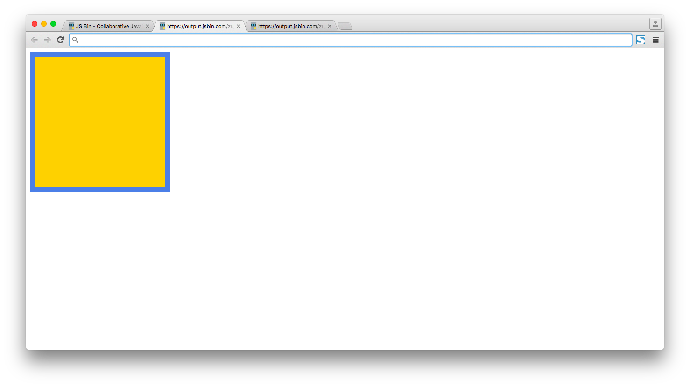

## Use `position: fixed` to recreate the following layouts:

### 7

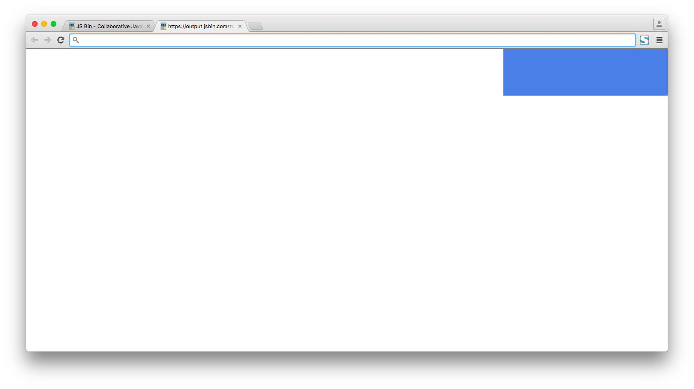

### 8

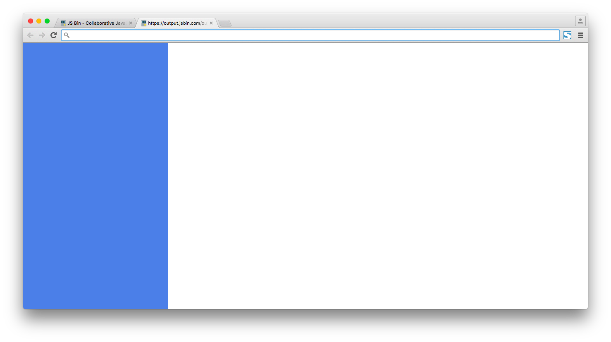

### 9

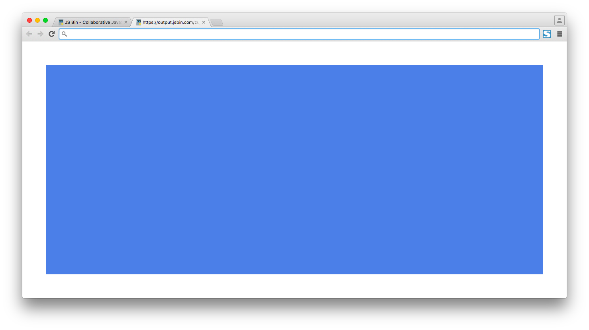

## Use `display: inline-block` to recreate the following layouts:

### 10

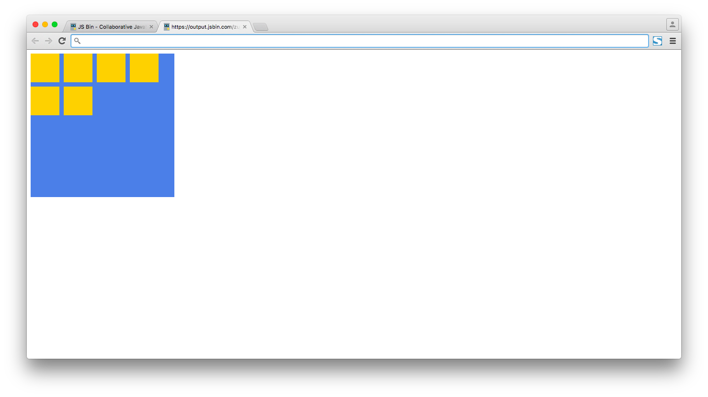

### 11

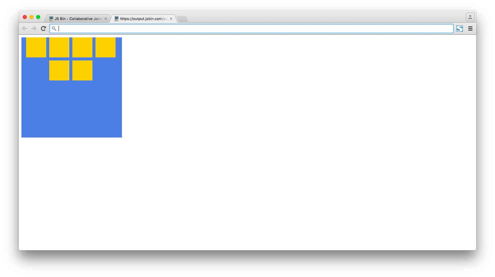

### 12

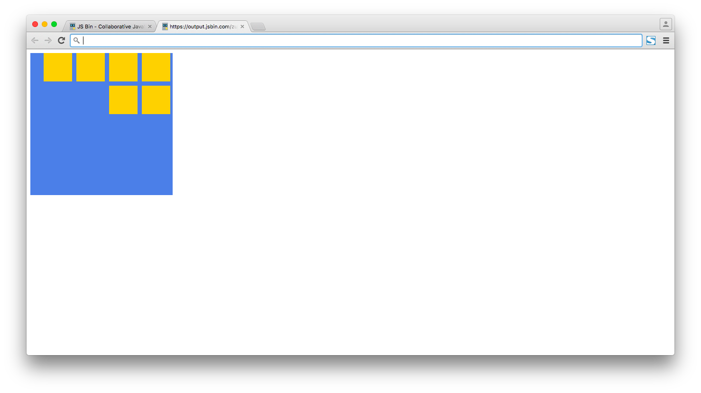
