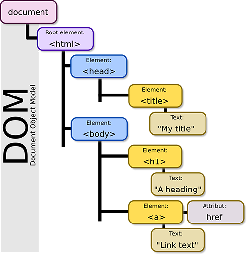

# Week 9 

## Javascript and the DOM

### Review: adding scripts to a page

There are two ways to add javascript to a webpage. Both use the `script` tag.

Inline scripts:

```javascript
<html>
<head></head>

<body>
	<script>
		console.log('hello')
		// Do some other stuff
	</script>
</body>
```

External scripts:

```javascript
<html>
<head></head>

<body>
	<script src="main.js"></script>
</body>
```

Some guidelines:

**Use external scripts.** Keeping your javascript and html separate makes your project more organized and your code more legible.

**Order matters.** Scripts run in the order they're included on the page. If your script relies on variables or functions defined in another script, that script must be loaded before your script can run. That mean that you should include it before your script in your HTML.

**Position your scripts at the very bottom of the body element**. That way they won't block page rendering as they load, and any html elements they interact with will already have been loaded when they run.

### The DOM

DOM stands for document object model. It's a representation of the contents of your page which is accessible and modifiable from your javascript. It looks something like this:



Note that it's a tree structure -- nodes can have both parents and children.

#### Document functions & properties

##### `document.querySelectorAll(selector)` and `document.querySelector(selector)`

These function very similarly to jQuery's `$` function. `querySelector` returns a single matching element, while `querySelectorAll` returns all matching elements on the page.

```javascript
var blueNodes = document.querySelectorAll('.blue');
console.log(blueNodes); // Would print all nodes with the class `blue`

var redNode = document.querySelector('.red');
console.log(redNode); /// Would print a single node with the class `red`
```

##### `document.createElement(elementName)`

Creates a new element. Takes the name of the element to be created as an argument. Here's how you would create a `div` element and add it to the page.

```javascript
var div = document.createElement('div');

document.body.appendChild(div);
```

##### `document.body`

Shortcut to get a reference to the `body` element of the current page.

```javascript
var body = document.body;
body.innerHTML = 'Hello!';
```

#### Element functions and properties

##### `element.appendChild(otherElement)`

Appends a child element to an element.

##### `node.addEventListener(eventName, eventHandler)`

Adds an event listener to an element. Commonly used events are:

- `mousedown`
- `mouseup`
- `mousewheel`
- `scroll`
- `click`
- `keydown`
- `keyup`
- `click`
- `resize`

```javascript
var button = document.querySelectorAll('.button')[0];

button.addEventListener('click', function (e) {
	console.log('You clicked the page at position [', e.pageX, ', ', e.pageY, ']');
});
```

##### `node.style`

A node's style property consists of an object that represents that node's **inline** style attribute. Modifying a node's style will modify how it's displayed. 

```javascript
var node = document.querySelector('div');
node.style.background = 'green';
```

It's important to note that javascript style property names are always in camelcase. That means that style properties have different names in CSS and javascript. Here are a few examples:

Javascript | CSS
---------- | ---
backgroundColor | background-color
marginTop | margin-top
borderRadius | border-radius

##### `setTimeout(fn, duration)`

`setTimeout` allows you to trigger a function after a set period of time has elapsed. It looks like this:

```javascript
setTimeout(function () {
  console.log('hi!');
}, 1000); // Will print 'hi!' after 1 second
``` 

It accepts a duration argument in milliseconds, so a duration of 1000 will cause a delay of 1 full second.

##### `setInterval(fn, duration)`

`setInterval` is very similar to `setTimeout` except that it will trigger the function you pass it repeatedly at an interval determined by the duration argument. Here's how it looks:

```javascript
setInterval(function () {
	console.log('hi');
}, 1000); // Will print 'hi' once per second
```

### Comparison between jQuery and DOM functions

#### Selecting elements

```javascript
// jQuery
$('.blue-link');

// DOM
document.querySelectorAll('.blue-link');
```

#### Creating elements

```javascript
// jQuery
var div = $('<div></div>');

// DOM
var div = document.createElement('div');
```

#### Creating an element and appending it to the body

```javascript
// jQuery
$('body').append('<div></div>');

// DOM
document.body.appendChild(document.createElement('div'));
```

#### Adding a click event handler to a single element

```javascript
// jQuery
$('a').eq(0).on('click', function () {
	console.log('clicked!');
});

// DOM
document.querySelector('a').addEventListener('click', function () {
	console.log('clicked!');
});
```